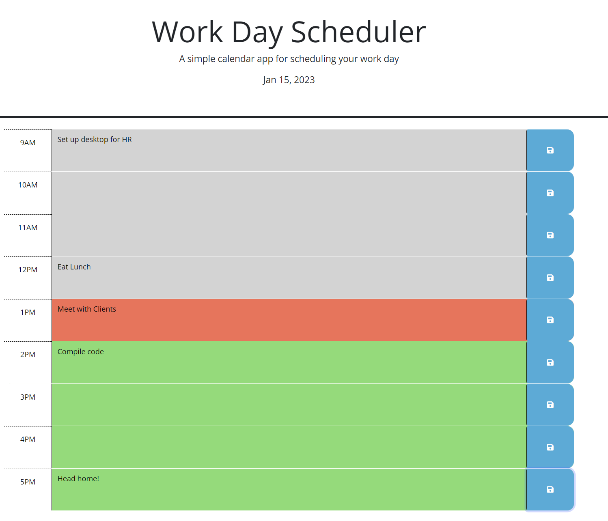

## Work Day Scheduler Challenge 5

## Description

This application is a work-day scheduler. Showing the hours of 9 to 5, that of the standard work day, it tracks the time blocks hour by hour and updates them accordingly to the hours of the day, making them green if they are in the future, red if the current hour, and gray if a past hour. The user is able to enter text to each of the blocks associated with the hours and save them to local storage. If saved to local storage, the text will remain even if the page is refreshed and will only be removed when replaced with other text or deleted and saved.

## Usage

A user can utilize this application as a way to schedule out their work days. For example, a user can enter "Meeting with clients" in the text box next to 11AM, "Eat lunch" in the text box next to 12PM, and "Compile code" in the 1PM box, and click the save button next to each one. The user can then exit out of the application and come back whenever they need to be reminded of their tasks for the day, while also utilizing the changing colors of the blocks associated with the time of day to keep track of what task they need to complete next.

## Image 1

## Link

https://tyler-hill.github.io/WorkDay-Sched-Ch5/

## Credits

Tyler Hill 2023
